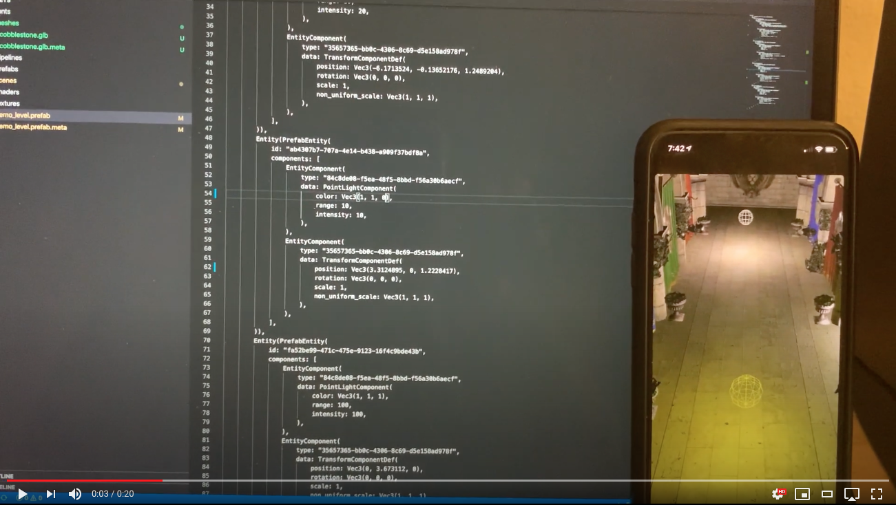

# renderer_prototype (Name TBD)

This is a vulkan renderer built on top of `atelier-assets`. The objective of this repo is to build a scalable, flexible,
data driven renderer. Scalable in the sense of performance as well as suitability for use in large, real-world projects.
This means streaming, LODs, visibility systems, and multi-threaded draw call submission need to be possible.
Additionally it means thinking through how an asset pipeline would work for a team with dedicated artists and supporting
workflow-friendly features like hot reloading assets, possibly on remote devices.

This is not an easy-to-use crate. I plan to provide a higher-level engine crate in the future. Extending and using
this crate directly requires a good understanding of vulkan.

Supported Platforms:
 * Windows
 * macOS (via MoltenVK)
 * iOS (via MoltenVK)
 * Linux

Android might work but I don't have hardware to test with.

The job/phase rendering design is inspired by the 2015 GDC talk "[Destiny's Multithreaded Rendering Architecture](http://advances.realtimerendering.com/destiny/gdc_2015/Tatarchuk_GDC_2015__Destiny_Renderer_web.pdf)". 

[](https://travis-ci.org/aclysma/renderer_prototype)

[](https://www.youtube.com/watch?v=Ks_HQbejHE4 "Video of Renderer in Use")

[^ Video of this renderer running on iOS hardware](https://www.youtube.com/watch?v=Ks_HQbejHE4) 

## Diagrams

 * [Diagram of key crate dependencies](https://github.com/aclysma/renderer_prototype/blob/master/docs/crate_dependencies.png)
 * [Pipelining](https://github.com/aclysma/renderer_prototype/blob/master/docs/pipelining.png)
 * [Diagram of rendering process](https://github.com/aclysma/renderer_prototype/blob/master/docs/render_process.png)


## Status

This project should still be considered a prototype, shared for informational purposes only. Please don't use it in
anything real yet!

The demo includes:
 * Render thread decoupled from main thread [(diagram)](https://github.com/aclysma/renderer_prototype/blob/master/docs/pipelining.png)
 * Async loading of assets (supports remote hardware)
 * Hot-reloading assets (needs more work, some asset types do not work reliably)
 * Game state stored in ECS (legion)
 * Extensible data-driven render pipeline
 * PBR Meshes
 * Sprites
 * Debug Draw
 * imgui
 * HDR Pipeline with Bloom

## Running the Demo

```
git clone https://github.com/aclysma/renderer_prototype.git
cd renderer_prototype
cargo update -p tokio --precise 0.2.13
cargo run --release
```

([Tokio >= 0.2.14 hangs](https://github.com/tokio-rs/tokio/issues/2390))

Running in release reduces logging and disables vulkan validation. The first time it will load more slowly because it
has to import the assets, including a GLTF mesh with large textures. Using profile overrides to optimize upstream crates
is HIGHLY RECOMMENDED. Asset processing is extremely slow in debug mode. (i.e. 30s instead of 2s)

The demo uses SDL2 and in debug mode, vulkan validation. If you have trouble running the demo, please check that
dependencies for both SDL2 and vulkan are available.

## Features

 * `renderer-shell-vulkan`, `renderer-shell-vulkan-sdl2` - Basic helpers for vulkan
   * Friendly helpers for setting up the device and window
   * Some basic, unopinionated helpers for vulkan. Things like async image uploads, deferring destruction of resources, 
     and pooling/reusing resources
 * `renderer-base` - Shared helpers/data structures. Nothing exciting
 * `renderer-nodes` - Inspired by the 2015 GDC talk "Destiny's Multithreaded Rendering Architecture." (A low-budget
   version and jobs are not actually MT yet)
   * A job system with extract, prepare, and write phases
   * Rendering is pipelined with simulation thread, and the job structure is intended to be highly parallel
   * Handles multiple views and phases allowing advanced features like shadow maps
   * Flexible sorting mechanism for interleaving and batching write commands from multiple rendering features
 * `renderer-visibility` - Placeholder visibility system. Doesn't do anything yet (returns all things visible all the 
   time). See the GDC talk for more info on how this will work.
 * `renderer-assets` - An asset loading and management system.
   * Nearly all vulkan assets are data-driven from files rather than hard-coded. Most things are hashed and reference
     counted
   * Buffers and images are asynchronously uploaded on dedicated transfer queue when available
   * Assets can hot reload from files (but see [#14](https://github.com/aclysma/renderer_prototype/issues/14))
   * Because atelier-assets pre-processes and stores cached assets as they change, custom processing/packing can be
     implemented while maintaining extremely fast load times. For example, texture compression could be implemented
     as an import step.  
   * Separate multi-thread friendly path for creating assets at runtime
   * Multi-pass material abstraction with bindable parameters

Notably, this project does not support multiple rendering backends. In the far future I'm open to the idea, but it's
simply out of scope right now (both due to time constraints and not having enough experience in rendering yet.) I also
would prefer to work with other rendering APIs (like metal, dx12) directly rather than through a complete generic
abstraction layer like gfx-hal.

## Roadmap

I am writing a higher-level crate to dogfood this and make it easier to use.

The demo shows a basic rendering pipeline with a GLTF importer, PBR, bloom, imgui, some debug drawing, and texture 
drawing. It also demonstrates how to pipeline rendering with simulation. It's not particularly pretty, but it does show
a fairly complete usage of the renderer.

## License

Licensed under either of

* Apache License, Version 2.0, ([LICENSE-APACHE](LICENSE-APACHE) or http://www.apache.org/licenses/LICENSE-2.0)
* MIT license ([LICENSE-MIT](LICENSE-MIT) or http://opensource.org/licenses/MIT)

at your option.

The demo/fonts directory contains several fonts under their own licenses:
 * [Feather](https://github.com/AT-UI/feather-font), MIT
 * [Material Design Icons](https://materialdesignicons.com), SIL OFL 1.1
 * [FontAwesome 4.7.0](https://fontawesome.com/v4.7.0/license/), available under SIL OFL 1.1
 * [`mplus-1p-regular.ttf`](http://mplus-fonts.osdn.jp), available under its own license.

### Contribution

Unless you explicitly state otherwise, any contribution intentionally
submitted for inclusion in the work by you, as defined in the Apache-2.0
license, shall be dual licensed as above, without any additional terms or
conditions.

See [LICENSE-APACHE](LICENSE-APACHE) and [LICENSE-MIT](LICENSE-MIT).
